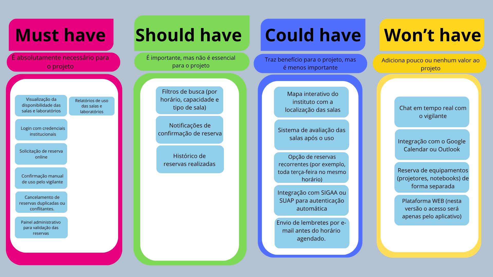

# 📘 TP3 – Imersão & Definição  
### Sistema de Agendamento de Salas e Laboratórios – UFAM (ICET)

Este repositório contém todos os artefatos produzidos na etapa de **Imersão e Definição** do projeto de IHC, incluindo:  
- Briefing com o cliente  
- Matriz CSD  
- Benchmarking  
- Personas  
- Jornada do Usuário  
- Priorização MoSCoW  

---

# 🧩 1. Briefing

### 👥 Clientes Potenciais
**Docente:** professor que precisa reservar salas para aulas, práticas e orientações. Hoje depende do vigilante e do caderno físico.

**Discente autorizado:** aluno que usa salas para reuniões, estudos em grupo e atividades acadêmicas, também usando o sistema manual atual.

> ❗ O processo atual é lento, burocrático, totalmente manual e sem transparência.

### 🗣️ Roteiro de entrevista
> "Olá, somos estudantes de IHC e estamos desenvolvendo um sistema para facilitar o agendamento das salas do instituto..."

Inclui perguntas sobre: funcionalidades essenciais, problemas do sistema atual, prioridades, possíveis integrações (SIGAA/SUAP), regras internas e atores envolvidos.

### 👩‍💻 Cliente C1 – Representante do Curso
Graduanda de Engenharia de Software, responsável pela comunicação entre alunos, coordenação e vigilância. Detalhou a necessidade de digitalizar o processo de reservas.

---

# 🧱 2. Matriz CSD  

A Matriz CSD organiza as informações em:  
- **Certezas:** fatos validados  
- **Suposições:** hipóteses  
- **Dúvidas:** pontos a investigar  

### 📸 Matriz construída  

---

# 📊 3. Benchmarking

Sistemas analisados:

1. **Google Calendar** – excelente interface e notificações, mas sem controle físico de chaves.  
2. **Microsoft Bookings** – robusto, porém pago e dependente da Microsoft.  
3. **Sistema de Reserva USP** – adequado ao ambiente acadêmico.  
4. **MRBS – IFAM** – mais próximo da UFAM, mas limitado ao ambiente interno.

### 🧠 Conclusão geral
Nenhum sistema atende totalmente ao contexto da UFAM.  
A solução proposta deve unir **praticidade digital** + **controle físico realizado pelo vigilante**.

---

# 👤 4. Personas & 🧭 5. Jornada do Usuário

Foram criadas três personas principais:

### 👮 Vigilante  
Responsável pelo controle das chaves.  
Começa **inseguro com tecnologia**, termina **confiante** com o uso do sistema.  
Dores: processos manuais, medo de cometer erros, falta de organização.

### 🎓 Estudante Autorizado  
Usuário que busca reservar salas com rapidez e transparência.  
Dores: deslocamento até o vigilante, falta de visualização em tempo real.

### 👨‍🏫 Docente  
Professor que busca autonomia e previsibilidade na reserva de salas.  
Dores: agenda cheia, dependência do vigilante, zero integração digital.

As jornadas completas estão em: `5-jornada-do-usuario/jornada-do-usuario.md`.

---

# 📌 6. Priorização MoSCoW

A técnica **MoSCoW** foi utilizada para classificar requisitos em:

- **Must Have:** essenciais (login institucional, visualização, reserva e confirmação do vigilante).  
- **Should Have:** importantes, mas não críticas (filtros de busca, histórico de reserva).  
- **Could Have:** incrementos (mapa interativo, recorrência de reservas).  
- **Won’t Have:** fora da versão atual (integração com Google Calendar, chat, plataforma web completa).

### 📸 Priorização  

---

# 📎 Arquivos úteis

- **Briefing:** `1-briefing/briefing.md`  
- **Matriz CSD:** `2-matriz-csd/matriz-csd.md`  
- **Benchmarking:** `3-benchmarking/benchmarking.md`  
- **Personas:** pasta `4-personas/`  
- **Jornada do usuário:** `5-jornada-do-usuario/jornada-do-usuario.md`  
- **MoSCoW:** `6-moscow/moscow.md`  

---

# ✔️ Conclusão

Este repositório documenta de forma completa a fase de **Imersão e Definição** do projeto, reunindo todas as informações essenciais para dar continuidade ao desenvolvimento da solução de agendamento de salas da UFAM.

