# 📌 HTAs — Hierarchical Task Analysis

---

# 1. Diagramas e Objetivos Correspondentes

Nesta seção estão os **diagramas**, cada um acompanhado do **objetivo correspondente**.

---

## **HTA 1 — Acessar o Sistema**
**Objetivo:** Permitir que o usuário entre no sistema de forma segura por meio do login institucional.  
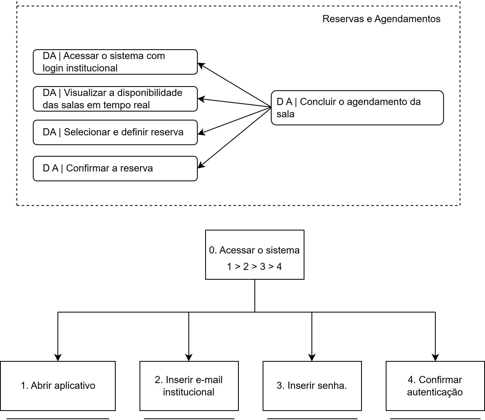

---

## **HTA 2 — Visualizar Disponibilidade**
**Objetivo:** Permitir que o usuário consulte, de maneira clara, a disponibilidade de salas no calendário geral.  
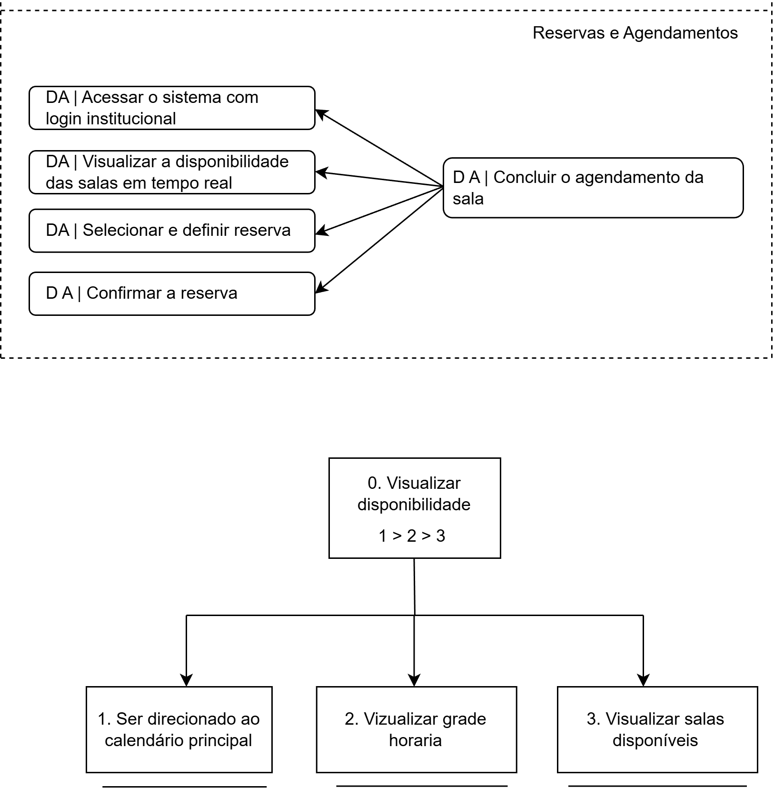

---

## **HTA 3 — Selecionar e Definir Reserva**
**Objetivo:** Guiar o usuário na escolha da sala disponível e no preenchimento das informações essenciais da reserva.  
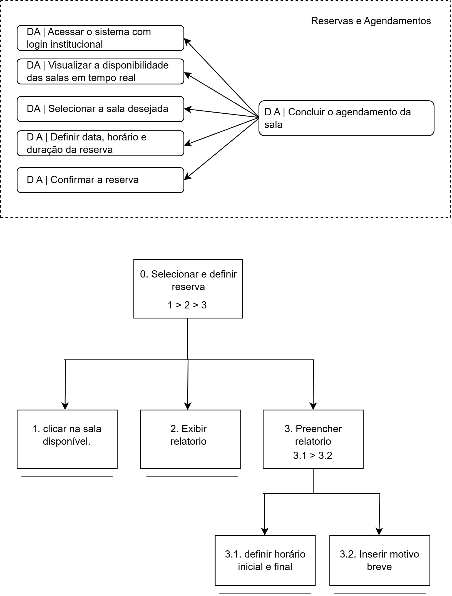

---

## **HTA 4 — Confirmar Reserva**
**Objetivo:** Finalizar o processo de reserva garantindo que o usuário revise e valide as informações.  
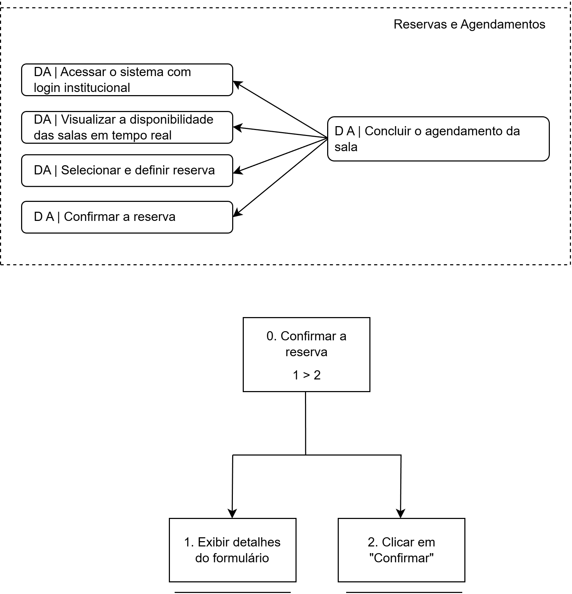

---

## **HTA 5 — Visualizar Reservas (Vigilante)**
**Objetivo:** Permitir que o vigilante consulte todas as reservas do dia no painel administrativo.  
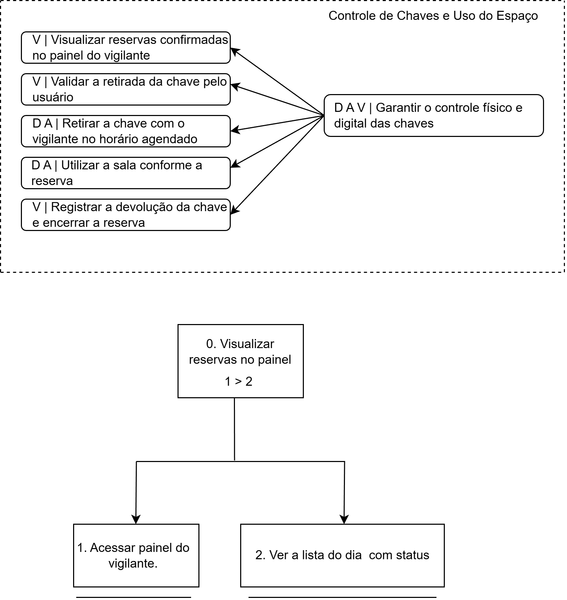

---

## **HTA 6 — Validar Retirada da Chave**
**Objetivo:** Garantir segurança no empréstimo de salas, validando a identidade e confirmando a entrega da chave ao usuário.  
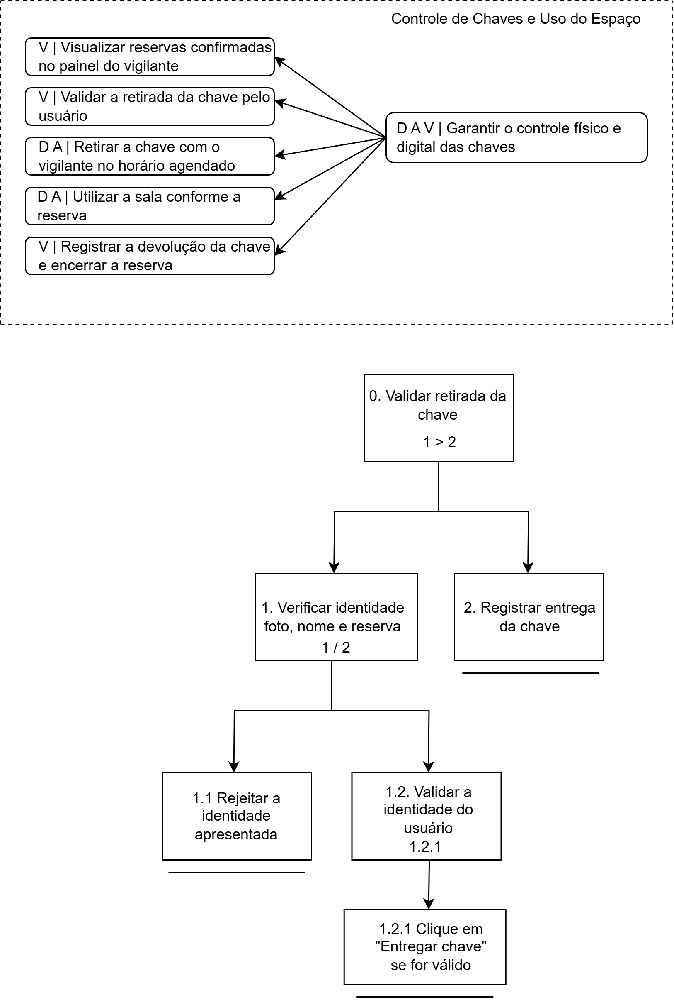

---

## **HTA 7 — Registrar Devolução**
**Objetivo:** Controlar a devolução da chave, atualizando o status e liberando a sala novamente para uso.  
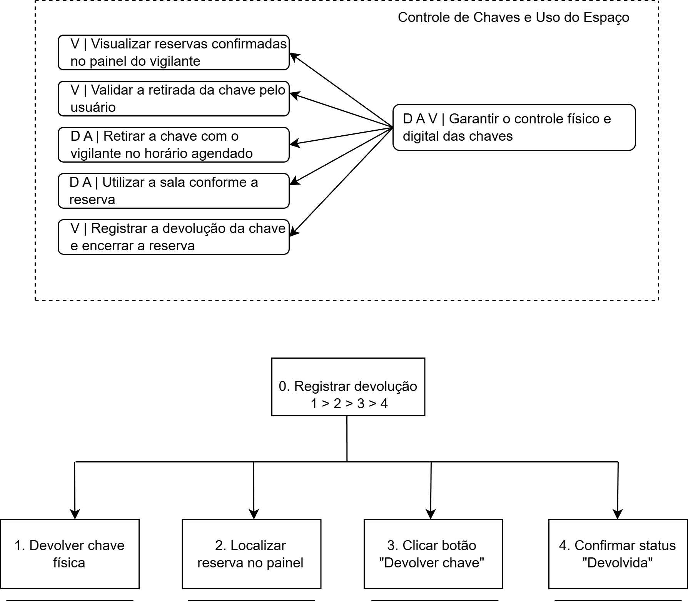

---

## **HTA 8 — Consultar Histórico**
**Objetivo:** Permitir que o vigilante acesse o histórico de reservas e filtre informações de forma organizada.  
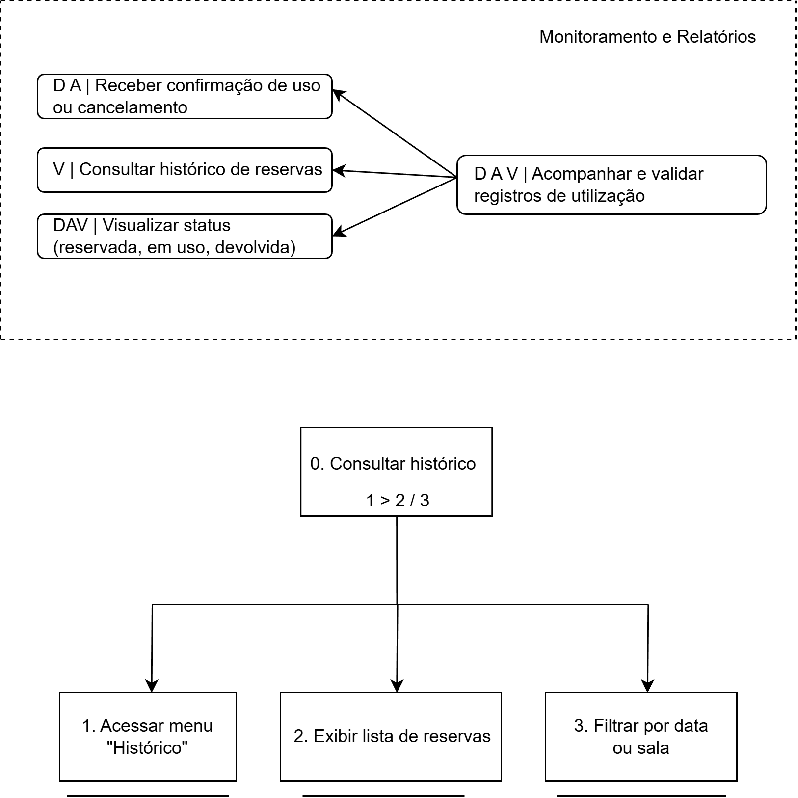

---

# 🟩 2. Descrição Detalhada das Tarefas (IMAGENS ANTIGAS)

Abaixo estão as versões dos HTAs com descrições completas.

---

## **HTA 1 – Acessar o sistema**

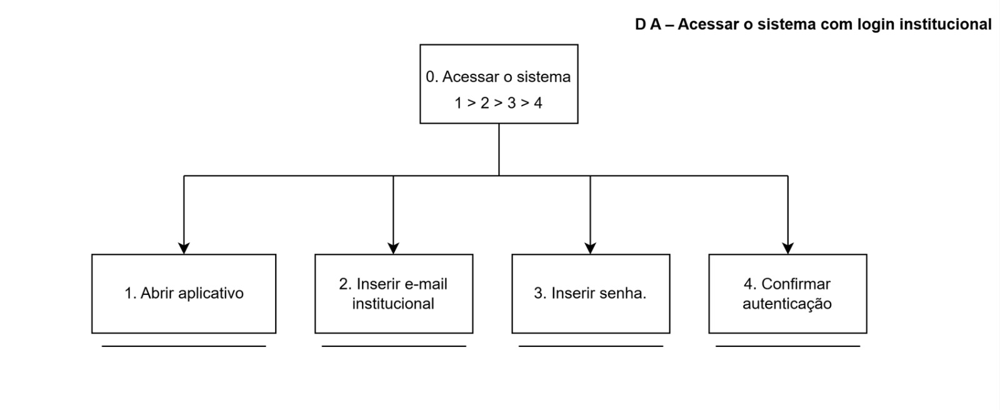

Essa funcionalidade descreve o fluxo necessário para que o usuário consiga acessar o sistema por meio do login institucional. O propósito do HTA é detalhar as etapas envolvidas nesse processo de autenticação, evidenciando a sequência lógica de ações, as decisões necessárias e como cada tarefa contribui para a segurança e a usabilidade do sistema. 

O fluxo inicia quando o usuário decide utilizar o serviço no aplicativo. Em seguida, são solicitadas informações institucionais, como e-mail e senha, garantindo que apenas pessoas autorizadas possam acessar o sistema. Por fim, ocorre a confirmação da autenticação, permitindo ao usuário prosseguir para as funcionalidades internas. 

---

## **HTA 2 – Visualizar disponibilidade**

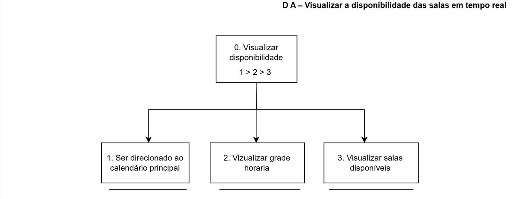

Essa funcionalidade permite que o usuário visualize a disponibilidade das salas por meio de um fluxo simples e direto. O objetivo do HTA é decompor o processo em etapas essenciais, mostrando como o usuário acessa e interpreta as informações oferecidas pelo sistema. 

Ao acessar a função, o usuário é inicialmente direcionado ao calendário principal, onde ocorre a navegação inicial. Em seguida, ele tem acesso à grade horária, que organiza os horários de forma estruturada para facilitar a interpretação. Por fim, o usuário pode visualizar a lista de salas disponíveis, relacionando os horários da grade às salas que podem ser utilizadas naquele momento. 

---

## **HTA 3 – Selecionar e definir reserva**

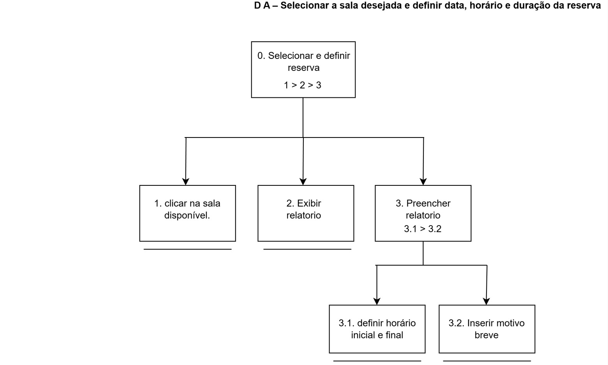

Essa funcionalidade descreve o processo pelo qual o usuário seleciona uma sala disponível e define os parâmetros básicos para realizar uma reserva. O objetivo do HTA é decompor esse fluxo em etapas claras, mostrando como o usuário avança desde a escolha inicial da sala até o preenchimento das informações necessárias para concluir o registro. 

O processo inicia quando o usuário clica em uma sala disponível. Em seguida, o sistema exibe um relatório com as informações essenciais para confirmar que a sala realmente pode ser reservada naquele horário. Após essa visualização, o usuário deve preencher o relatório, definindo dois elementos fundamentais: o horário inicial e final da reserva e um motivo breve que justifique o uso do espaço.  

---

## **HTA 4 – Confirmar reserva**

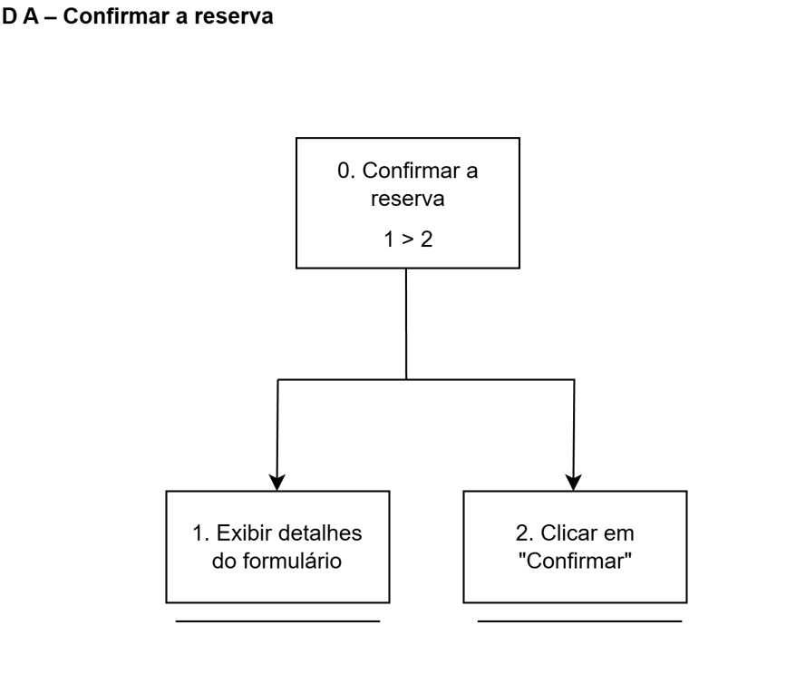

A funcionalidade de confirmação da reserva representa o momento em que o usuário finaliza o processo, validando as informações apresentadas pelo sistema. O objetivo do HTA é evidenciar como essa etapa, embora breve, envolve a revisão dos dados exibidos para que o usuário tenha segurança antes de concluir a ação. 

Inicialmente, o sistema exibe os detalhes do formulário preenchido anteriormente, permitindo ao usuário verificar se as informações estão corretas. Em seguida, o usuário prossegue clicando no botão Confirmar, formalizando a reserva.

---

## **HTA 5 – Visualizar reservas no painel**

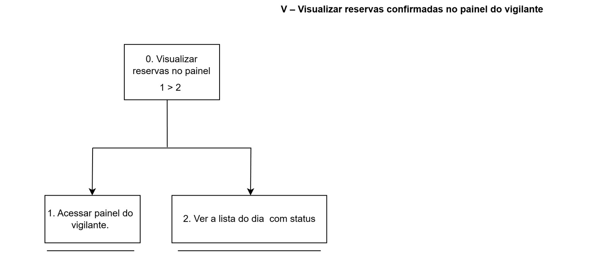

Esta funcionalidade descreve o processo pelo qual o vigilante acessa o painel destinado ao acompanhamento das reservas. O objetivo do HTA é detalhar as etapas essenciais para que o vigilante visualize, de forma organizada, as reservas do dia. 

Primeiro, o vigilante acessa o painel próprio do sistema, que centraliza as informações relevantes para sua função. Em seguida, ele visualiza a lista das reservas do dia, incluindo o status associado a cada uma delas.

---

## **HTA 6 – Validar retirada da chave**

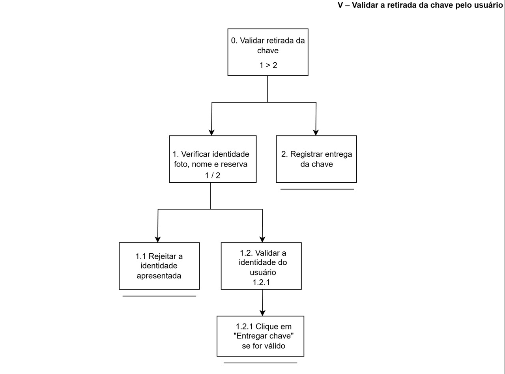

Essa funcionalidade descreve o processo pelo qual o vigilante valida a retirada da chave por parte do usuário que fez a reserva. O objetivo do HTA é detalhar as etapas necessárias para confirmar a identidade do usuário e autorizar ou não a entrega da chave. 

Primeiro, o vigilante verifica a identidade do usuário comparando foto, nome e informações da reserva. A partir dessa verificação, duas possibilidades são apresentadas: rejeitar a identidade, caso não corresponda aos dados da reserva, ou validá-la quando estiver correta. Se a identidade for validada, o vigilante conclui a ação clicando na opção de Entregar chave. 

Paralelamente, o sistema registra a entrega, garantindo que a operação seja marcada adequadamente dentro do fluxo de uso das salas. O encadeamento apresentado no HTA mostra de forma clara e objetiva como o processo se estrutura, permitindo ao vigilante tomar a decisão correta em cada etapa. 

---

## **HTA 7 – Registrar devolução**

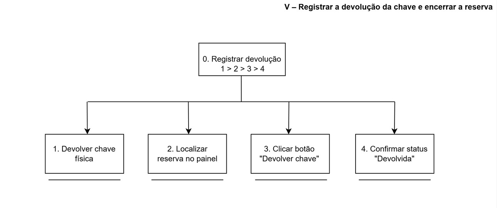

Essa funcionalidade representa o encerramento do ciclo de uso da sala. Seu objetivo é registrar, de forma clara e segura, que o usuário devolveu a chave e que a sala está novamente disponível para novas reservas. O HTA detalha cada etapa envolvida nesse processo, garantindo rastreabilidade e transparência no fluxo de empréstimo e devolução. 

O procedimento começa com o usuário entregando a chave física ao vigilante. Em seguida, o vigilante localiza no painel a reserva correspondente, confirma a devolução e encerra oficialmente o uso da sala no sistema. Esse registro evita conflitos, assegura organização e mantém o controle atualizado do estado físico das salas.

---

## **HTA 8 – Consultar histórico**

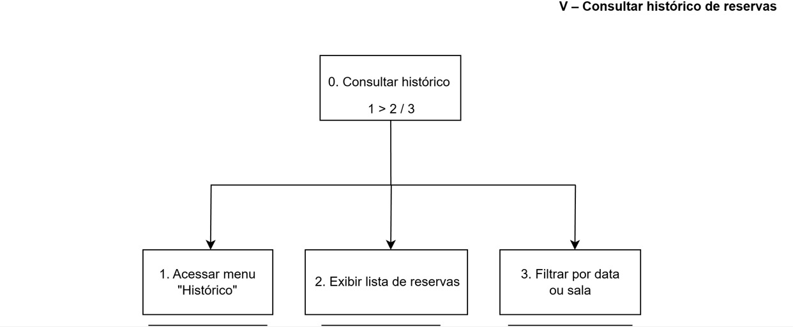

Essa funcionalidade descreve o processo pelo qual o vigilante consulta o histórico de reservas realizadas anteriormente. O objetivo do HTA é detalhar as etapas essenciais que permitem ao usuário acessar essas informações de forma simples e organizada. 

Primeiro, o vigilante acessa o menu Histórico, onde estão reunidas as reservas já concluídas. Em seguida, o sistema exibe a lista dessas reservas para visualização geral. Caso deseje, o vigilante pode aplicar filtros por data ou por sala, facilitando a localização de registros específicos dentro do histórico.

---

