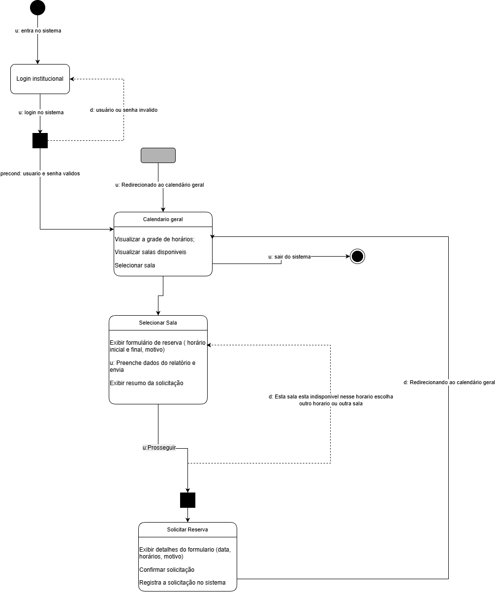
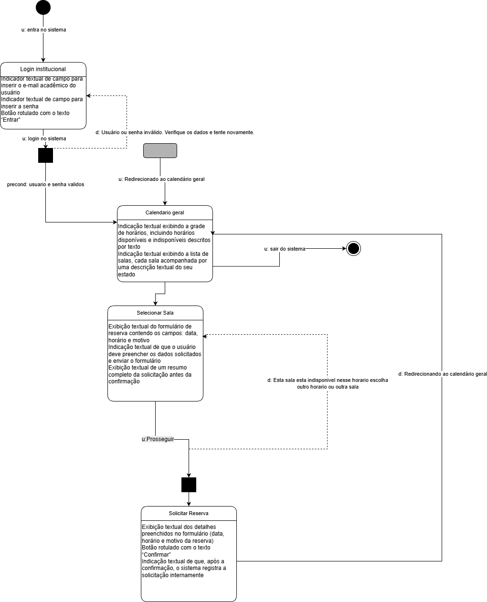
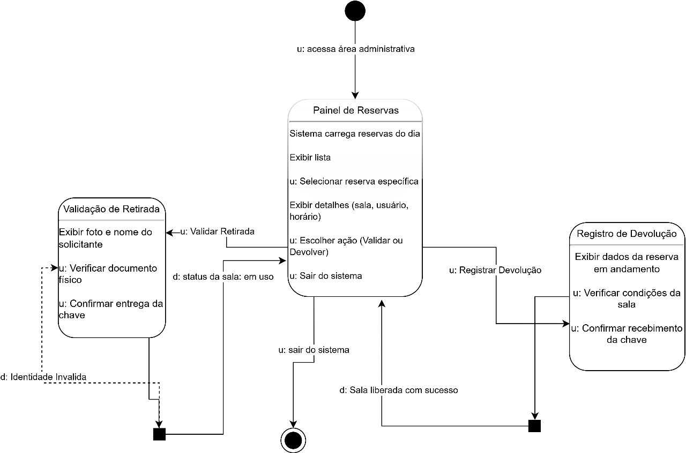

# 🧩 Diagramas MoLIC – Agendamento de Salas e Laboratórios (UFAM)

A seguir estão os diagramas MoLIC desenvolvidos para o sistema, acompanhados de explicações claras para facilitar a compreensão, mesmo por quem não conhece a notação.

---

# 📘 1. MoLIC – Usuário Padrão

Este diagrama representa o **fluxo de interação do usuário comum (docente ou discente autorizado)** ao realizar uma reserva no sistema.

### **O que acontece no diagrama:**

1. **Entrada no sistema** – o usuário acessa a plataforma e faz login com e-mail e senha institucionais.  
2. **Validação** – caso digite credenciais incorretas, o sistema exibe uma mensagem de erro.  
3. **Calendário Geral** – após login bem-sucedido, o sistema mostra:
   - grade de horários  
   - salas disponíveis e indisponíveis  
4. **Seleção da sala** – o usuário escolhe uma sala na lista.  
5. **Formulário de reserva** – o sistema exibe campos para:
   - data  
   - horário inicial e final  
   - motivo da reserva  
6. **Confirmação** – o usuário revisa o resumo e confirma.  
7. **Registro no sistema** – a reserva é salva e finalizada.

Este diagrama mostra **todo o caminho do usuário até concluir uma reserva**.

---

# 📘 2. MoLIC – Usuário Daltônico

Este diagrama representa o mesmo fluxo de reserva do usuário comum, porém **adaptado para acessibilidade**, garantindo que pessoas com daltonismo possam usar o sistema sem dificuldades.

### **O que muda neste diagrama:**

- Elementos visuais são substituídos por:
  - **descrições textuais**  
  - **forma/estrutura**, em vez de cores  
- Estados das salas (disponível/indisponível) são apresentados **por texto**, não por cor.
- Campos e botões têm **descrições explícitas**, evitando que o usuário dependa de distinção cromática.

Este diagrama demonstra o compromisso com **acessibilidade e design inclusivo** no sistema.

---

# 📘 3. MoLIC – Vigilante

Este diagrama representa o fluxo do **vigilante**, responsável por validar retirada de chave, acompanhar reservas e registrar devoluções.

### **O que acontece no diagrama:**

### 🔹 **1. Acesso ao Painel de Reservas**
- O vigilante entra na área administrativa.
- O sistema carrega todas as reservas do dia.
- Ele pode:
  - ver a lista completa  
  - selecionar uma reserva específica  
  - visualizar detalhes (sala, usuário, horário)

### 🔹 **2. Validação da Retirada da Chave**
- O sistema mostra foto e nome do solicitante.
- O vigilante confere documento físico.
- Se estiver correto → ele confirma a entrega da chave.  
- Se estiver incorreto → o sistema sinaliza *identidade inválida*.

### 🔹 **3. Uso da Sala**
- O sistema atualiza o status para **"em uso"**.

### 🔹 **4. Devolução da Chave**
- O vigilante registra a devolução.
- Ele verifica condições da sala.
- O sistema confirma que a chave foi recebida.

### 🔹 **5. Finalização**
- O status da sala é atualizado para **"liberada"**.

Este diagrama mostra como o vigilante controla todo o fluxo físico de chaves, garantindo segurança e organização.

---

# ✔️ Conclusão

Os três diagramas juntos representam:

- o fluxo do **usuário comum**  
- uma versão **acessível e inclusiva** para daltônicos  
- o fluxo administrativo do **vigilante**  

Todos asseguram uma navegação clara, segura e coerente dentro do sistema.

