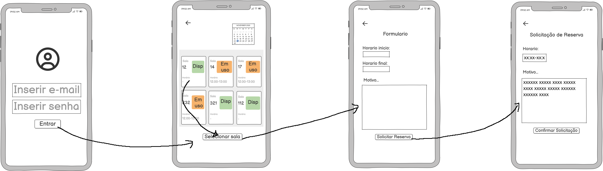
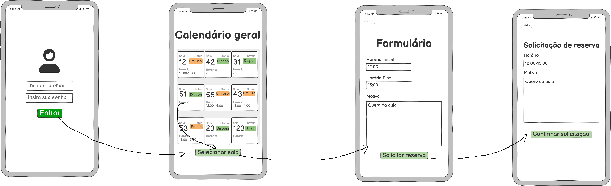

# 🧩 Comparação entre MoLIC e Protótipos de Baixa Fidelidade  
## (Com explicação + telas preferidas pela equipe)

A seguir estão os diagramas MoLIC relacionados diretamente às telas de baixa fidelidade.  
Cada bloco apresenta o **fluxo MoLIC acima** e a **tela correspondente abaixo**.

---

# 👤 1. Usuário – MoLIC e Telas

## 🔶 MoLIC do Usuário

O MoLIC do usuário descreve o fluxo completo realizado pelo Docente ou Discente Autorizado ao tentar reservar uma sala.  
Ele inclui:

- Entrada no sistema via login institucional  
- Redirecionamento ao calendário geral  
- Visualização da grade de horários  
- Seleção da sala desejada  
- Preenchimento do formulário de reserva  
- Revisão e confirmação da solicitação  

Esse fluxo define todas as intenções, operações e respostas do sistema durante a reserva.

---

## 🔹 Tela do Usuário – Versão 1

 
A versão 1 apresenta uma interface funcional, mas ainda pouco organizada para navegação fluida.  
Os elementos estão presentes, porém a hierarquia visual não transmite clareza suficiente para a tomada de decisão rápida.

---

## 🔹 Tela do Usuário – Versão 2

A versão 2 apresenta um layout mais limpo, mais organizado e mais próximo do fluxo descrito no MoLIC.  
A separação entre as informações, o campo visual e os comandos está mais clara, o que melhora a compreensão do usuário e reduz dúvidas ao preencher uma reserva.

### ⭐ **Versão escolhida pela equipe:** **Versão 2**

---

## 🔹 MoLIC para usuarios Daltônicos *(usa a mesma tela do usuário)*

A versão adaptada para daltônicos não altera a tela, pois o fluxo cognitivo permanece o mesmo.  
A tela consiste em:

- Evitar dependência de cores para transmitir status  
- Utilizar descrições textuais em vez de colorações  
- Aumentar contraste e espessura de elementos  
- Padronizar ícones e indicadores sem uso de cores conflitantes  

Essa tela é compatível com **tanto usuários comuns quanto daltônicos**.

### ⭐ **Versão escolhida pela equipe:** **Versão 2 do usuário**

---

# 🛡️ 2. Vigilante – MoLIC e Telas

## 🔶 MoLIC do Vigilante

O MoLIC do vigilante representa todas as etapas administrativas relacionadas ao controle de chaves e uso das salas:

- Acesso ao painel administrativo  
- Visualização de reservas do dia  
- Validação da retirada da chave (checagem de identidade)  
- Registro de devolução  
- Alteração do status da sala (em uso / liberada)  

Esse fluxo é fundamental para garantir segurança, registro e rastreabilidade no uso dos espaços.

---

## 🔹 Tela do Vigilante – Versão 1

A versão 1 traz os elementos necessários, mas ainda possui distribuição densa de informações, o que pode tornar a validação mais lenta durante períodos movimentados.  
Há pouca separação visual entre ações de validação e devolução.

---

## 🔹 Tela do Vigilante – Versão 2

A versão 2 apresenta:

- Melhor organização do painel  
- Separação mais clara entre “validar retirada” e “registrar devolução”  
- Fluxo mais direto e compatível com o MoLIC  
- Redução de elementos que distraem  

Ela facilita o trabalho do vigilante e reduz erros de operação.

### ⭐ **Versão escolhida pela equipe:** **Versão 2**

---

# ✔️ Conclusão Geral

Após análise comparativa entre MoLIC e Sketches, a equipe decidiu que:

### 🎯 **Para todas as telas (usuário, daltônico e vigilante), a Versão 2 foi escolhida como a melhor.**

Os motivos:

- maior clareza visual  
- melhor alinhamento com o MoLIC  
- separação correta das ações por prioridade  
- fluxo mais fluido e menos sujeito a erro  
- experiência do usuário mais intuitiva  

Esses protótipos servirão como base para o protótipo de média fidelidade.

